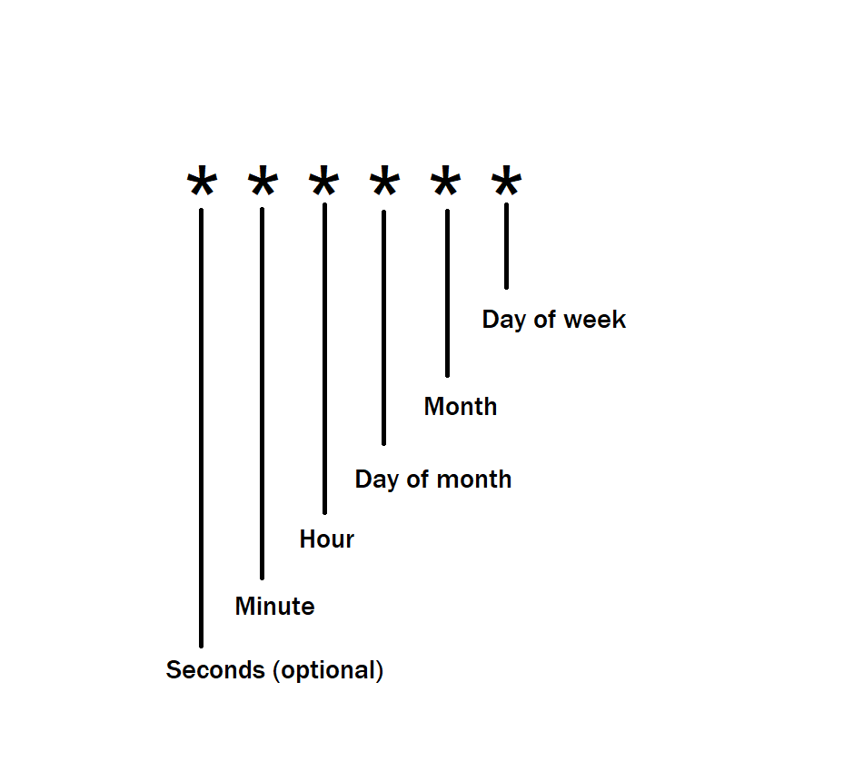

# Documentation: Email Service Implementation

This document provides a comprehensive explanation of the email service setup and functionality using Node.js, Nodemailer, and environment variables.

## Overview

The email service is responsible for sending transactional emails using an SMTP server. It leverages the Nodemailer library for email delivery and dotenv for managing environment variables.

## Implementation Details

### Imports and Dependencies

import nodemailer from "nodemailer";
import dotenv from "dotenv";
import { text } from "express";
dotenv.config();

- **`nodemailer`**: Library for sending emails via SMTP.
- **`dotenv`**: Loads environment variables from a `.env` file.
- **`express` (optional)**: Included but unused, can be removed for optimization.

### Environment Variables

Environment variables are used to configure SMTP server details securely. Add the following keys to a `.env` file:

SMTP_HOST=<SMTP_HOST>
SMTP_PORT=<SMTP_PORT>
SMTP_SECURE=<true_or_false>
SMTP_USER=<SMTP_USER>
SMTP_PASSWORD=<SMTP_PASSWORD>
SMTP_FROM=<SENDER_EMAIL>

**Note:** Replace placeholders with actual values.

### SMTP Configuration

#### Constants for Environment Variables

const SMTP_HOST = process.env.SMTP_HOST;
const SMTP_PORT = process.env.SMTP_PORT;
const SMTP_SECURE = process.env.SMTP_SECURE;
const SMTP_USER = process.env.SMTP_USER;
const SMTP_PASSWORD = process.env.SMTP_PASSWORD;
const SMTP_FROM = process.env.SMTP_FROM;

- Loaded from the `.env` file for secure access.

#### Nodemailer Transporter

const transporter = nodemailer.createTransport({
host: SMTP_HOST,
port: SMTP_PORT,
secure: SMTP_SECURE === "true", // Ensure correct type conversion
auth: {
user: SMTP_USER,
pass: SMTP_PASSWORD,
},
tls: { rejectUnauthorized: false },
});

- **`secure`**: Converts `SMTP_SECURE` to a boolean for proper functionality.
- **`tls.rejectUnauthorized`**: Set to `false` to bypass certificate validation (not recommended for production).

### SMTP Verification

transporter.verify((error, success) => {
if (success) console.log("SMTP success from emailservice.js ", success);
else console.log("SMTP Error", error);
});

- Verifies the SMTP configuration to ensure the server is reachable.

## Email Sending Functionality

### `sendEmail` Function

#### Parameters

- `to`: Recipient's email address.
- `subject`: Subject line of the email.
- `content`: HTML content of the email.

#### Implementation

export const sendEmail = async (to, subject, content) => {
try {
const mailOptions = {
from: SMTP_FROM,
to,
subject,
text: "this is a text ",
html: content,
};

    await transporter.sendMail(mailOptions);

} catch (error) {
console.log("Error received that happened during mail send", error);
}
};

- **Mail Options**:

  - `from`: The sender's email address (configured in `.env`).
  - `to`: The recipient's email address.
  - `subject`: Subject line for the email.
  - `text`: Plain text fallback for email content.
  - `html`: Rich HTML content of the email.

- **Error Handling**: Logs errors during email transmission.

## Logging

#### SMTP Verification Logs

console.log("transpoter verification done now going to send email");

Provides a checkpoint indicating the verification phase is complete.

#### Error Logs

console.log("Error received that happened during mail send", error);

Logs any errors encountered during the email-sending process.

==========================================================================================================================================

Now create the route and use it

## Endpoint: `/send-deadline-reminders`

### Method: POST

### Purpose

To send email reminders for tasks whose deadlines are approaching within the next 24 hours.

## Implementation Details

### Imports and Dependencies

import { sendEmail } from "../services/emailService.js";
import express from "express";
import Task from "../models/Task.js";
import User from "../models/User.js";

- **`sendEmail`**: Utility for sending emails.
- **`express`**: Framework for building web APIs.
- **`Task`**: Mongoose model for tasks.
- **`User`**: Mongoose model for users.

### Router Setup

export const router = express.Router();

Initializes an Express router instance for defining API endpoints.

### Endpoint Logic

#### 1. Calculate "Tomorrow"

const tomorrow = new Date(Date.now() + 24 _ 60 _ 60 \* 1000);

This calculates a timestamp for 24 hours from the current time.

#### 2. Query Tasks

const tasks = await Task.find({
$and: [{ completed: false }, { deadline: { $lt: tomorrow } }],
});

- Filters tasks that:

  - Are not completed (`completed: false`).
  - Have a deadline within the next 24 hours (`deadline: { $lt: tomorrow }`).

#### 3. Send Emails

For each task:

1. Fetch the user details using the `userId` field.
2. Check if the user has an email address.
3. Send an email reminder using `sendEmail`.

Code snippet:

tasks.forEach(async (task) => {
const user = await User.findOne({ \_id: task.userId });

if (user.email) {
await sendEmail(
user.email,
`Reminder: ${task.title} deadline approaching`,
`<h3>⏰ Task Reminder</h3>
      
Your task <strong>"${task.title}"</strong> is due by <strong>${new Date(task.deadline).toLocaleString()}</strong>.

      
Please complete it on time.
`
);
}
});

#### 4. Response Handling

- **Success Response**:

return res.status(200).json({ messag: `Reminder sent for ${tasks.length} tasks` });

- **Error Response**:

return res.status(400).json({ messag: `Reminder sent error`, error });

## Error Handling

- **Database Errors**: Handled by the `try-catch` block.
- **Missing Email**: Skips tasks if the user's email is unavailable.

## Example Response

### Success

json{
"messag": "Reminder sent for 5 tasks"
}

### Error

json{
"messag": "Reminder sent error",
"error": "Detailed error message"
}

==========================================================================================================================================

# Documentation: Cron Job for Deadline Reminders

This document explains the implementation of a cron job using the `node-cron` library to schedule periodic tasks, specifically sending deadline reminders via an HTTP POST request.

## Overview

The cron job executes a scheduled task daily at a specified time. It sends a POST request to an endpoint responsible for managing and sending reminders about task deadlines.

## Cron Time Syntax

Cron jobs use a five-field time format to specify the schedule. Below is the breakdown of each field and their possible values:

| **Field**              | **Allowed Values**       | **Description**                         |
| ---------------------- | ------------------------ | --------------------------------------- |
| **Seconds (optional)** | 0 - 59                   | (Optional) The seconds to run the task. |
| **Minute**             | 0 - 59                   | The minute to run the task.             |
| **Hour**               | 0 - 23                   | The hour to run the task.               |
| **Day of the Month**   | 1 - 31                   | The day of the month to run the task.   |
| **Month**              | 1 - 12                   | The month to run the task.              |
| **Day of the Week**    | 0 - 7 (0 and 7 = Sunday) | The day of the week to run the task.    |

## Examples

| **Cron Expression** | **Description**                                 |
| ------------------- | ----------------------------------------------- |
| `*/10 * * * *`      | Runs every 10 minutes.                          |
| `* * 21 * *`        | Runs every minute on the 21st day of the month. |
| `0 8 * * 1`         | Runs at 8:00 AM every Monday.                   |

## Implementation Details

### Imports and Dependencies

import axios from "axios";
import cron from "node-cron";

- **`axios`**: Used to make HTTP requests to the reminder endpoint.
- **`node-cron`**: Library for scheduling cron jobs in Node.js.

### Cron Job Setup

The `cron.schedule` method is used to configure the schedule and define the task to be executed.

#### Implementation

cron.schedule('12 0 \* \* \*', async () => {
try {
console.log("schedule start");
await axios.post("http://localhost:3000/reminder/send-deadline-reminders");
console.log("schedule end");
} catch (error) {
console.error("Cron Error : ", error);
}
});

#### Explanation of Schedule

- **`12 0 * * *`**: Executes the task daily at 12:00 AM.

## Time Zone Consideration

### Local Time vs. GMT

By default, `node-cron` uses **local server time** for scheduling tasks.

#### Adjusting Time Zone

To schedule tasks using a specific time zone (e.g., GMT), you need to use a library like `node-cron-tz` or manually adjust the schedule.

Example with Time Zone:

import cron from "node-cron";
import { zonedTimeToUtc } from "date-fns-tz";

cron.schedule("12 0 \* \* \*", async () => {
const nowInGMT = zonedTimeToUtc(new Date(), "GMT");
console.log("Task executed at (GMT):", nowInGMT);
});
